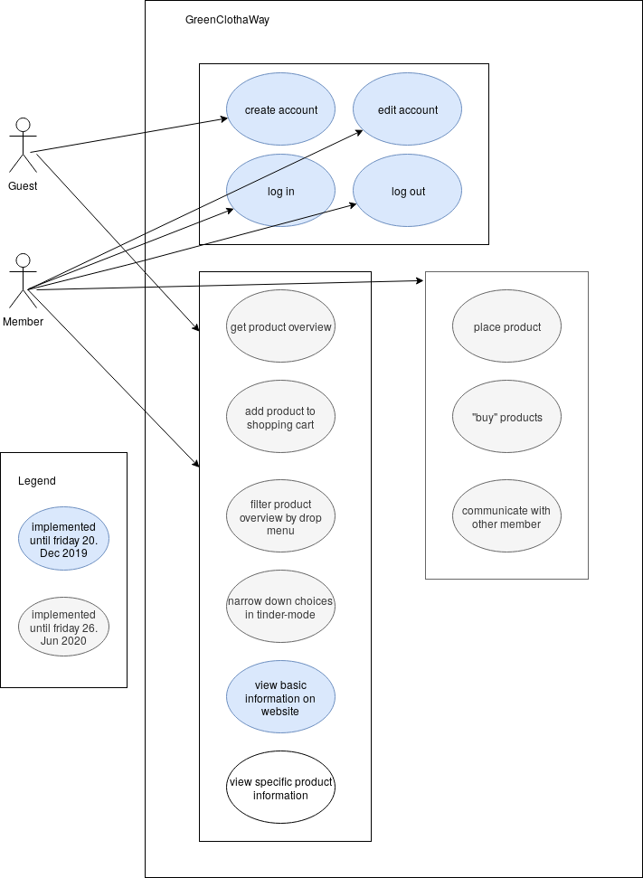

# GreenClothaWay - Software Requirements Specification

## Table of Contents

-   [GreenClothaWay - Software Requirements Specification](#GreenClothaWay---software-requirements-specification)

    -   [Table of Contents](#table-of-contents)

    -   [1. Introduction](#1-introduction)

        -   [1.1 Purpose](#11-purpose)
        -   [1.2 Scope](#12-scope)
        -   [1.3 Definitions, Acronyms and Abbreviations](#13-definitions-acronyms-and-abbreviations)
        -   [1.4 References](#14-references)
        -   [1.5 Overview](#15-overview)

    -   [2. Overall Description](#2-overall-description)

        -   [2.1 Vision](#21-vision)

    -   [2.2 Product perspective](#22-product-perspective)

        -   [2.3 User characteristics](#23-user-characteristics)
        -   [2.4 Dependencies](#24-dependencies)

    -   [3. Specific Requirements](#3-specific-requirements)

        -   [3.1 Functionality – Data Backend](#31-functionality--data-backend)

            -   [3.1.1 Read data given over API endpoints](#311-read-data-given-over-api-endpoints)
            -   [3.1.2 Parse data](#312-parse-data)
            -   [3.1.3 Provide data](#313-provide-data)

        -   [3.2 Functionality – User Interface](#32-functionality--user-interface)

            -   [3.2.1 User system](#321-user-system)
            -   [3.2.3 Flashcard boxes](#323-flashcard-boxes)
            -   [3.2.4 Flashcards](#324-flashcards)
            -   [3.2.5 Statistics](#325-statistics)

        -   [3.3 Usability](#33-usability)

        -   [3.4 Reliability](#34-reliability)

            -   [3.4.1 Availability](#341-availability)
            -   [3.4.2 MTBF, MTTR](#342-mtbf-mttr)
            -   [3.4.3 Accuracy](#343-accuracy)
            -   [3.4.4 Bug classes](#344-bug-classes)

        -   [3.5 Performance](#35-performance)

            -   [3.5.1 Response time](#351-response-time)
            -   [3.5.2 Throughput](#352-throughput)
            -   [3.5.3 Capacity](#353-capacity)
            -   [3.5.4 Resource utilization](#354-resource-utilization)

        -   [3.6 Supportability](#36-supportability)

        -   [3.7 Design Constraints](#37-design-constraints)

            -   [3.7.1 Development tools](#371-development-tools)
            -   [3.7.2 Spring Boot](#372-spring-boot)
            -   [3.7.3 ReactJS](#373-reactjs)
            -   [3.7.4 Supported Platforms](#374-supported-platforms)

        -   [3.8 Online User Documentation and Help System Requirements](#38-online-user-documentation-and-help-system-requirements)

        -   [3.9 Purchased Components](#39-purchased-components)

        -   [3.10 Interfaces](#310-interfaces)

            -   [3.10.1 User Interfaces](#3101-user-interfaces)
            -   [3.10.2 Hardware Interfaces](#3102-hardware-interfaces)
            -   [3.10.3 Software Interfaces](#3103-software-interfaces)
            -   [3.10.4 Communications Interfaces](#3104-communications-interfaces)

        -   [3.11 Licensing Requirements](#311-licensing-requirements)

        -   [3.12 Legal, Copyright and other Notices](#312-legal-copyright-and-other-notices)

        -   [3.13 Applicable Standards](#313-applicable-standards)

    -   [4. Supporting Information](#4-supporting-information)

## 1. Introduction

### 1.1 Purpose

The purpose of this document gives a general description of the GreenClothaWay Project. It explains our vision and all features of the product. 
Also it offers insights into the system of back- and frontend, the interfaces in both ends for communication and the constraints of the product.

### 1.2 Scope

This document is designed for internal use only and will outline the development process of the project.

### 1.3 Definitions, Acronyms and Abbreviations

| Term     |                                     |
| -------- | ----------------------------------- |
| **SRS**  | Software Requirements Specification |
| **JSON** | JavaScript Object Notation          |
| **API**  | Application Programming Interface   |
| **MTBF** | Mean Time Between Failures          |
| **MTTR** | Mean Time To Repair                 |
| **DTO**  | Data Transfer Object                |
| **HTTP** | Hypertext Transfer Protocol         |
| **FAQ**  | Frequently Asked Questions          |
| **REST** | Representational State Transfer     |

### 1.4 References

| Title                                                                                                 | Date       |
| ----------------------------------------------------------------------------------------------------- | ---------- |
| [Blog](https://blog.greenclothaway.eu/)                                                               | 14/10/2019 |
| [GitHub](https://github.com/GreenClothaWay/Website)                                                   | 14/10/2019 |
| [YoutTrack](https://youtrack.greenclothaway.eu)                                                       | 19/10/2019 |
| [Django](https://djangoproject.com/)                                                                  | 19/10/2019 |
| [Bootstrap](https://getbootstrap.com/)                                                                | 21/10/2019 |

### 1.5 Overview

The next chapters provide information about our vision based on the use case diagram as well as more detailed software requirements.

## 2. Overall Description

### 2.1 Vision

The goal of GreenClothaWay is to create an online trading marketplace for clothes which were offered for free.
Users can offer their old clothes that they don´t like anymore. Other users can take this clothes for free. 
They have only to pay shipping costs or if it´s possible they can collect their clothes.

## 2.2 Product perspective

Our Use-Case-Diagram

### 2.3 User characteristics

Our main target group consists of people who want to protect our planet. 
Also people who have not enough money to buy everytime new clothes are effected by our business model.

### 2.4 Dependencies

GreenClothaWay´s Marketplace depends on a database where all inserted clothes are stored. 
This Marketplace also requires a database where all user information are stored.

## 3. Specific Requirements

### 3.1 Functionality – Data Backend

The backend is needed to store, filter and get clothing data. Also it has to store and create data for new customers. 
It verifies that each user has his own login credentials and attached to them his own personal information such as country, city, address.
Furthermore it is very important that this data is stored securely.

#### 3.1.1 Communication between frontend and backend

For the communication between frontend and backend django will facilitate this communication a lot. 
Django API can present information from the frontend to the backend easily. 
It sends data automatically formatted to the backend, where django also administers those data.
Maybe it is necessery that we have to use JSON in similar parts.

#### 3.1.2 Store and get data

After data is processed from the backend it will be stored in a PostResSQL Database.
A Database allows to filter data, what is important for customers, that they can filter by size, colour, etc.

### 3.2 Functionality – User Interface

The frontend provides a user interface for the marketplace. This user interface includes a product overview with filter options, a shopping card, user information, communication with other members. 
The product overview includes filter options that customers can filter by colour, size, type, etc.
Furthermore the product overview implements a Tinder filter mode, that users allow to swipe yes or no. 
Those clothes which were swiped yes will be added to a personal list for clothes that you like in a seperate overview.

#### 3.2.1 User system

At registration, the data provided by the user is stored in the backend. After registration users can order and insert clothes.

Sign Up:
-   [Sign UP](https://greenclothaway.eu/.....)
Log In:
-   [Log In](https://greenclothaway.eu/.....)

#### 3.2.3 Insert clothes 

Inserting clothes is very easy. Take some pictures from your garment and fill in the product description form. 
The product description form includes information about size, form, colour, condition, etc.
-   [Insert clothes](https://greenclothaway.eu/....)

#### 3.2.4 Buy clothes

A flashcard data is composed of a virtual front- and backpage. For a better overview, flashcards can only be accessed from a individual flashcard boxes.
According use cases are:

-   [Flashcards](https://github.com/phoenixfeder/fc-com/blob/master/UseCases/FlashCard/FlashCard.md)

#### 3.2.5 Shopping cart

Statistics contains information about the learning progress of individual flashcard boxes and is saved per single user, not per box.

### 3.3 Usability

We will build the user interface intuitive, so that a new user does not necessarily need an explanation. If questions arise our interface provides a comprehensive FAQ. If the user doesn't know the principle of flashcards and a system to learn with them, the user interface provides a manual how to learn with flashcards as well.

### 3.4 Reliability

In the following we describe the availability, MTBF and MTTR, accuracy and bug classes we strive for.

#### 3.4.1 Availability

Since we are trying to focus on a bug free application rather than caring about hosting it on our own, the availability depends on the hosting
provider we choose. Due redundancy and other security arrangements, most providers can ensure an uptime over 99.9% of the time its hosted at their datacenter.

#### 3.4.2 MTBF, MTTR

If the application fails due an hardware issue, then the mean times are up to our hosting provider. Since the ensured uptime of most hosting providers
is 99.9%, they try to fix the issue within a few minutes.
However, if the application fails due a bug in our code, we can revert the code to a previous version that worked fine. This shouldn't take more than
one or two hours from the point on we noticed.

#### 3.4.3 Accuracy

We can't ensure that the information on the flashcards will be correct since they will be provided by the user itself. As we develop the functions on our own, we can only guarantee that our F.A.Q. will be correct.

#### 3.4.4 Bug classes

We classify bugs like the following:

-   **Critical bug**: A critical bug occurs when the database starts dropping data without intention, secret user information, like passwords, are open to the public or users are not able to use the application at all.
-   **Non critical bug**: A non critical bug appears when the user still can use the application but it appears glitched and the user experience is slightly influenced.

### 3.5 Performance

In general, we try to keep to user experience fluent and response times low. High peaks can still appear when the user loads a large flashcard box or the hosting provider is currently having issues.

#### 3.5.1 Response time

As nearly the whole UI will be loaded initially, even pages that aren't shown yet, will appear within less than 100ms when accessed. A huge flashcard box (200 and more) can take a one or two seconds to load, especially when the backend currently needs to handle a larger
amount of requests.

#### 3.5.2 Throughput

The amount of transactions between the frontend or the backend totally depends on the users behaviour. There will be a few more transactions
when a user accesses the application initially, but as long he isn't requesting a lot of flashcard boxes hardly any transactions will occur.

#### 3.5.3 Capacity

Current database management software is able to handle single tables up to 65TB of data. Therefore one can say we theoretically able to host
a nearly unlimited amount of flashcards. Of course we are not able to afford such a huge database, but even on a small storage we can easily host enough flashcards for a small user base.

#### 3.5.4 Resource utilization

Once requested flashcards are loaded, we try to keep them on the client side as long as possible. Thus we decline the waiting time for the user
and leave open resources for other requests by other users.

### 3.6 Supportability

Our frontend, backend and each functionality will be clearly separated and we try to stick to naming conventions which are common in the used technologies.
Furthermore we aim to keep our code clean which we can't guarantee though. Thereby we make it easy to understand our infrastructure and avoid possible confusion
when one needs to edit older parts of the application.

### 3.7 Design Constraints

We are focused on building a modern-looking application using modern technologies. Of course there are other smaller libraries and frameworks used than the ones that
are listed, but they represent just a small fraction of the whole project and aren't worth mentioning. Especially in ReactJS one does add a lot of external modules.

#### 3.7.1 Development tools

-   Git: version control system
-   JetBrains IntelliJ: Spring MVC backend development
-   JetBrains WebStorm: React JS frontend development
-   Maven: Build management
-   YouTrack: Project planning tool
-   Travis CI: Continous integration service
-   Codacy: Code quality
-   SonarCloud: Code coverage and metrics

#### 3.7.2 Spring Boot

Spring Boot is built on top of the Spring framework and provides the developer with helpful features to create and run web applications. In our case, a REST Web Service
which represents the interface between our front- and backend. As we want to benefit from the newest features of Java 10, the platform this service will be hosted on needs to support Java 10 or higher.

#### 3.7.3 ReactJS

ReactJS helps building interactive UIs that can be updated dynamically and therefore eliminate the need to refresh the web application. One can also develop single components and can reuse them all over the application. Such a component could be a login form, a profile card or anything else one wants to reuse. We are going to import a React framework called Material-UI that provides a lot of pre-defined components. Its design based on, oh wonder, the Material-Design. The development will
take place with the newest version of JavaScript. Fortunately, our development environment is able to compile it to the lower version of JavaScript. Thus, we can
use the newest features without having to worry about browser compatibility.
Furthermore we will extend ReactJS with Redux. Redux allows us to keep track of state changes in the frontend and is able to notify other components about it. For further reading see [here](https://github.com/phoenixfeder/fc-com/blob/master/SoftwareArchitectureDocument.md#2-architectural-representation).

#### 3.7.4 Supported Platforms

Since FlashCardCommunity will be a web application the user only needs a modern web browser and a stable internet connection. With modern web browser we mean the
current versions of Mozilla Firefox, Google Chrome, Opera, Edge and even IE down to version 9 will be supported!

### 3.8 Online User Documentation and Help System Requirements

We want a provide a F.A.Q. for possible questions that can come up when using our application. Since it can be frustrating when a F.A.Q. doesn't really help with your answering problems, we want each F.A.Q. to be easy to understand and follow. For example a F.A.Q. that answers how to create a flashcard will include step-by-step
instructions and enough pictures to show the user exactly what to click at.

### 3.9 Purchased Components

-   N\\A

### 3.10 Interfaces

#### 3.10.1 User Interfaces

Our User Interface will provide one page for each implemented functionality.
To navigate between these sites the user will find a menu bar at the sides.

Since we are using the Material UI framework the application will be accessible from either desktop or mobile browsers.

#### 3.10.2 Hardware Interfaces

-   N\\A

#### 3.10.3 Software Interfaces

Our backend implements a REST-API, whose URLs our frontend can invoke with Http-Requests.
We will prepare base URLs for data concerning the user as well as the flashcards. For each base URL one can choose to either receive the data to show them on the website or push new data to our backend.

These data will be processed by our backend and then passed to our database.
The connection between our backend and the database will be managed by Hibernate.

#### 3.10.4 Communications Interfaces

Each HTTP-Request and Response contains a JSON.
By  interpreting its content our system will be able to transfer all needed data between front- and backend.

### 3.11 Licensing Requirements

Our project runs under the MIT License. This way everyone is allowed to create his own version.

### 3.12 Legal, Copyright and other Notices

-   N\\A

### 3.13 Applicable Standards

-   N\\A

## 4. Supporting Information

For a better overview, watch the table of contents and/or references.
